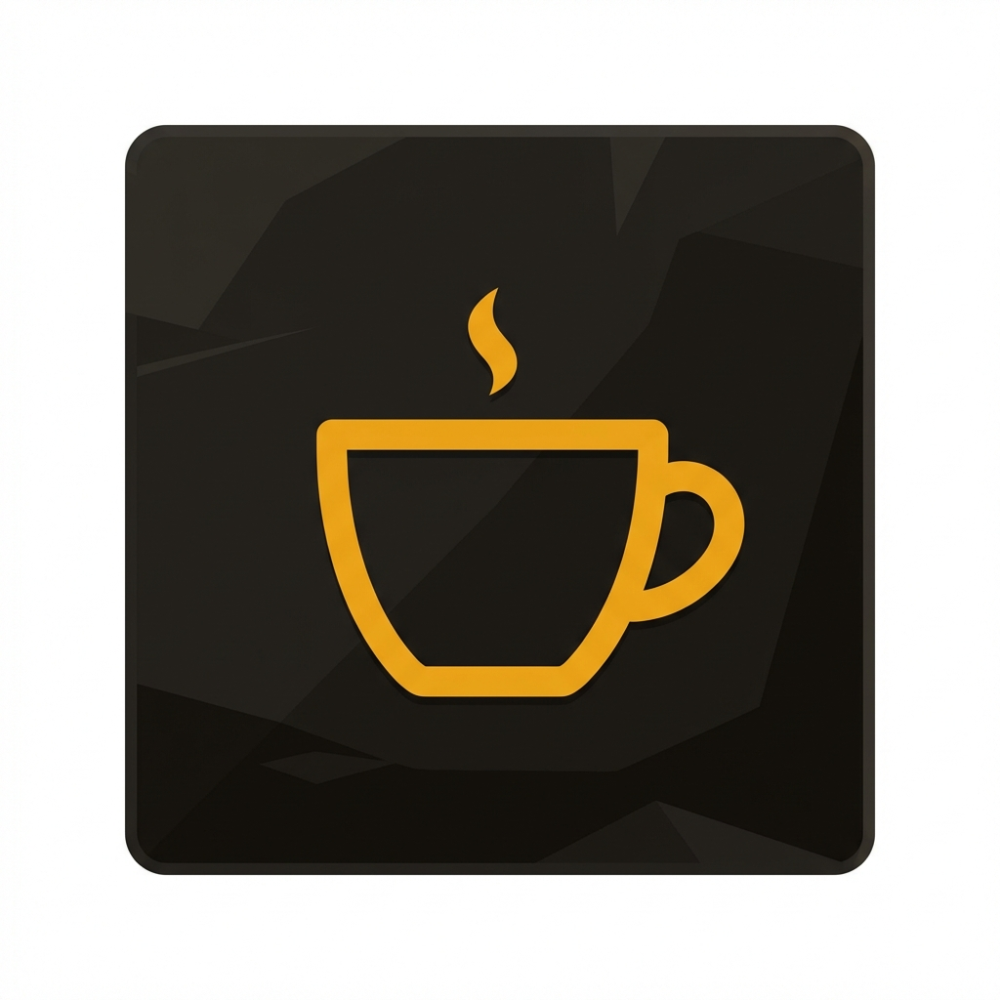

# ☕ Personal Coffeshop


<br />

<div align="center">
  
  <h1>The Ultimate Home Host Experience</h1>
  <p><em>A seamless Order Management & Kitchen Display System for the modern home café.</em></p>
</div>

<br />

> ### 🏡 The Passion Project
>
> _"The Personal Coffeshop is born from a simple desire: **to be the ultimate host.** With a move to a new house on the horizon, I wanted a system that lets my friends—connected to my Wi-Fi—order their favorite coffee exactly how they like it. It transforms my kitchen into a streamlined café, allowing me to focus on crafting the perfect cup rather than remembering who wanted oat milk."_ > _Powered by caffeine and questionable life choices ☕_\_

---

## 📸 The Experience

### 1. The Guest Experience

_Friends scan a QR code (or browse to your local IP) and land on a beautiful, app-like menu._

|                **Browsing the Menu**                |                          **Customizing the Drink**                           |
| :-------------------------------------------------: | :--------------------------------------------------------------------------: |
|  |  |

|               **Reviewing the Cart**                |                        **Order Success**                        |
| :-------------------------------------------------: | :-------------------------------------------------------------: |
|  |  |

### 2. The Host Experience (Barista Mode)

_I receive orders in real-time on my kitchen display._

<div align="center">
  
  <p><em>Real-time Kitchen Display System (KDS) showing incoming orders, modifiers, and "VIP" status.</em></p>
</div>

---

## 🛠️ The "Host-First" Architecture

Most POS systems are built for profit; this one is built for **hospitality**.

- **⚡ Zero Latency Performance:** Powered by **[Bun](https://bun.sh/)** and **[Next.js 15](https://nextjs.org/)** (App Router) for near-instant server-side rendering and static delivery.
- **📡 Real-time Synchronization:** Leveraging **Firestore snapshots** for a "no-refresh" experience. When you click "Preparing" in the kitchen, your friend's phone vibrates in the living room instantly.
  -\* **🔥 Minimal Hustle Backend:** Managed by **Firebase** for handling authentication and database, with minimal UI and zero server maintenance—less hustling for more efficient hosting.
- **📱 PWA Implementation:** Optimized meta tags and manifest allow guests to "Install" the app on their phone for a native feel without an app store download.
- **🎨 Adaptive Design:** The Guest view is mobile-first, while the Admin Dashboard is optimized for an iPad mounted on the kitchen wall (KDS style).

## ✨ Features Comparison

| Feature               | Guest App (Friend)                    | Admin Dashboard (Host)    |
| :-------------------- | :------------------------------------ | :------------------------ |
| **Real-time Updates** | Tracks Order Status (Pending → Ready) | Instant Ticket Arrival 🔔 |
| **Persistence**       | LocalStorage Cart (Resume later)      | Firestore State Sync      |
| **Data Usage**        | Minimal (Static Assets Cached)        | High Density Grid View    |
| **Authentication**    | Anonymous / Guest Logic               | Secure Admin Login        |

---

## 🚀 Getting Started

### Prerequisites

- **Bun**: `curl -fsSL https://bun.sh/install | bash`
- **Firebase Project**: Authentication (Email + Anonymous), Firestore.

### 1. Installation

```bash
git clone https://github.com/RohiRIK/Personal-coffeshop.git
cd Personal-coffeshop
bun install
```

### 2. Environment Setup

Create `.env.local` using your Firebase config:

```env
NEXT_PUBLIC_FIREBASE_API_KEY=AIzaSy...
NEXT_PUBLIC_FIREBASE_AUTH_DOMAIN=...
NEXT_PUBLIC_FIREBASE_PROJECT_ID=...
...
```

### 3. Database Schema (Firestore)

You need to create these collections or run the seed script (coming soon).

- **`menu`**: Documents with fields `{ name, price, description, category, available (bool), imageUrl }`
- **`orders`**: Stores the transactions.
- **`users`**: Stores user profiles and VIP stats.
- **`inventory`**: `{ id: "milk_whole", stock: 100 }`

### 4. Running for Guests (Local Wi-Fi) 📡

To let friends access the app, you need to run it on your **local IP address**.

```bash
bun run dev --host 0.0.0.0
```

1.  Find your computer's IP (e.g., `ifconfig` -> `192.168.1.5`).
2.  Tell friends to visit `http://192.168.1.5:9025`.
3.  **Pro Tip**: Generate a QR code for this URL and print it out!
4.  **Why Port 9025?** "The Precision Recipe"
    - **9 (Bars):** The industry standard for pump pressure.
    - **25 (Seconds):** The lower bound of the ideal extraction window.
    - _It effectively encodes the "minimum viable parameters" for a high-quality espresso shot._

---

## 🔮 Future Roadmap

- 🖨️ **Thermal Printer Integration**: Auto-print receipts when an order is placed.
- 🗣️ **Voice Commands**: "Hey Siri, order my usual" (via Shortcuts).
- 📊 **Recommendation Engine**: "You usually drink Lattes at this time, want one?"

---

## 📄 License

MIT © [RohiRIK](https://github.com/RohiRIK)
