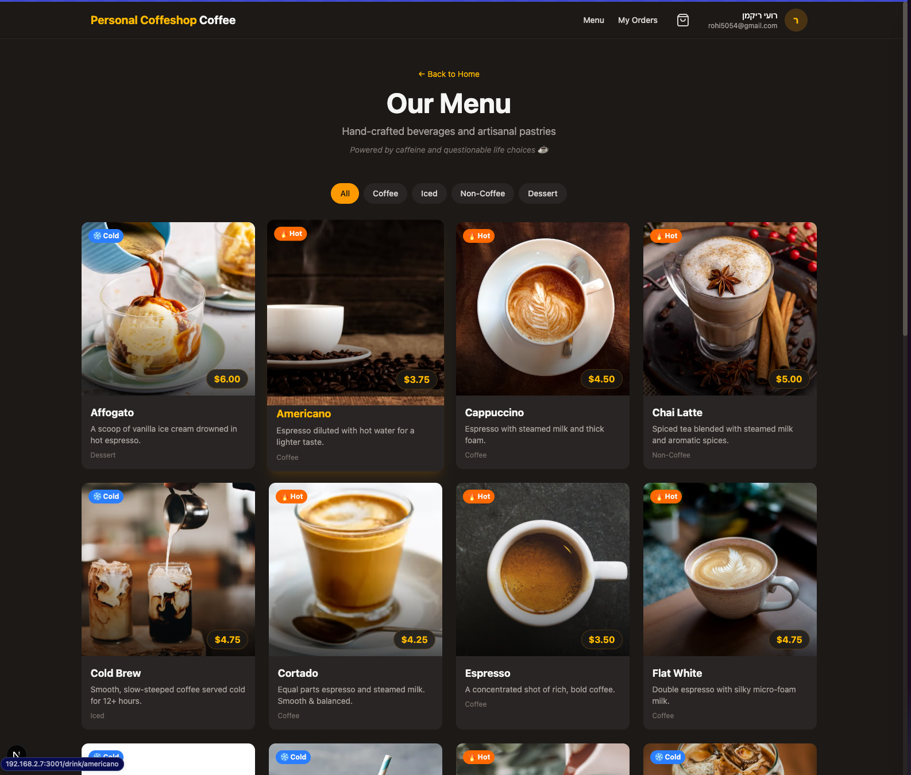
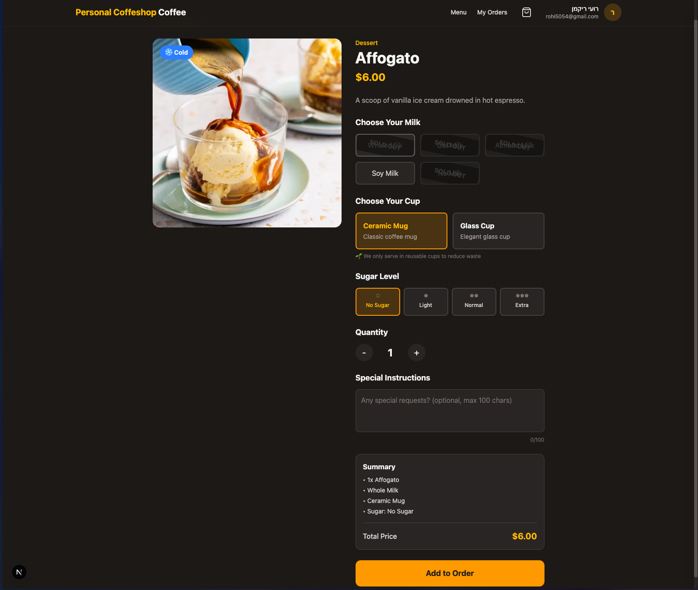
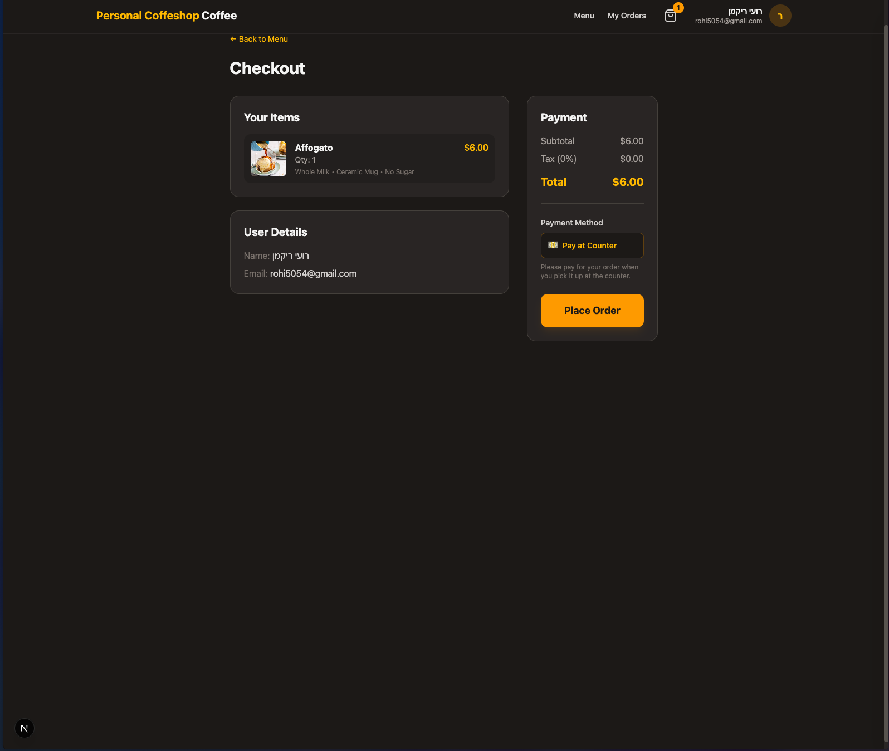
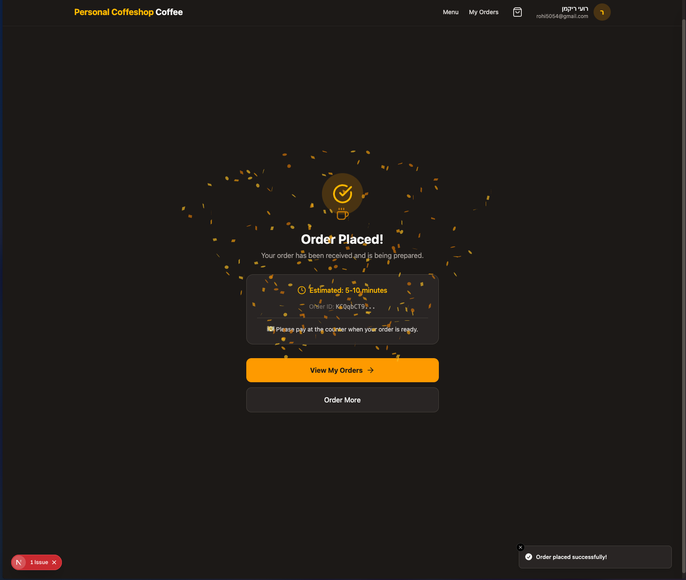
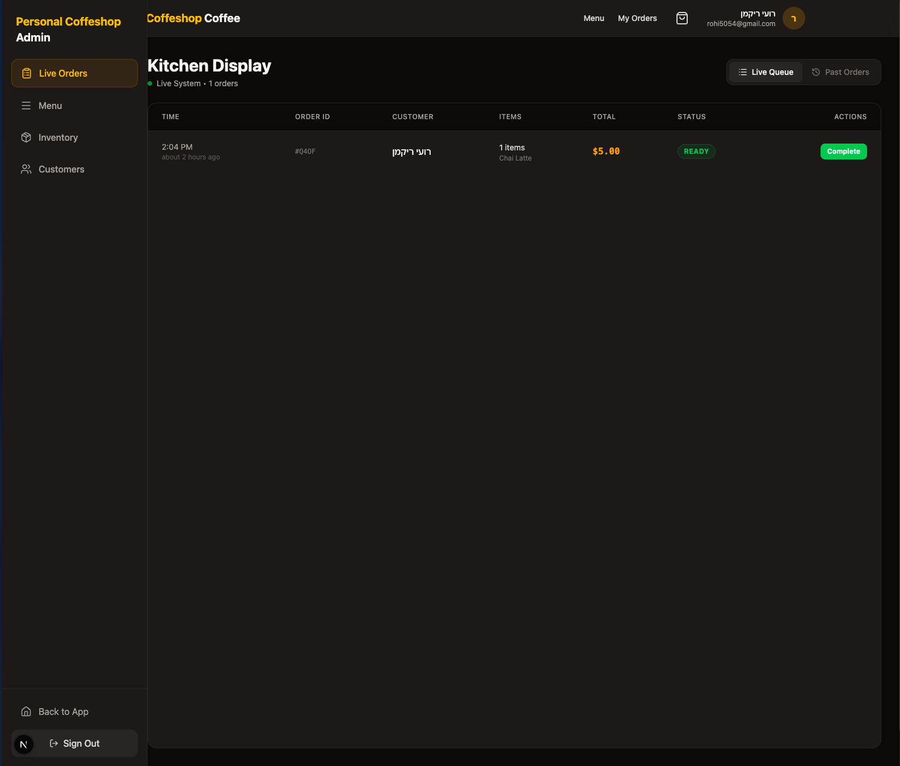

# ☕ Personal Coffeshop (v2)

The **Personal Coffeshop** is a passion project born from a simple desire: **to be the ultimate host.**

With a move to a new house on the horizon, I wanted to create a system that lets my friends—connected to my Wi-Fi—order their favorite coffee exactly how they like it, directly from their phones. It transforms my home kitchen into a streamlined café, allowing me to focus on crafting the perfect cup rather than remembering who wanted oat milk.

## ✨ Features

### 👤 Customer Experience

- **Menu & Customization**: Browse drinks with rich visuals, filters, and customize options (milk, cup, notes).
- **Cart System**: Persistent local cart with real-time totals.
- **User Accounts**: Order history tracking, favorite items analysis, and "My Orders" status tracking.
- **Live Updates**: Watch your order go from _Pending_ → _Preparing_ → _Ready_ instantly.

### 👔 Admin Dashboard (Kitchen Display)

- **Live Order Queue**: A high-density KDS (Kitchen Display System) to manage incoming orders.
- **Status Control**: One-click status updates (Pending → Preparing → Ready → Completed).
- **Menu Management**: Reactively toggle item availability (Sold Out) and manage prices.
- **Inventory Management**: Real-time stock control for modifiers (Milk, Cups).
- **Customer Insights**: View "VIP" status, total spend, and favorite drinks directly in the order ticket.
- **📱 PWA Ready**: Installable on iOS/Android with offline support and app-like experience.

### 🐳 Deployment

- **Docker**: Containerized with optimized `oven/bun:alpine` image.
- **GHCR**: Automated builds pushed to GitHub Container Registry.

## 🛠️ Tech Stack

- **Framework**: [Next.js 15](https://nextjs.org/) (App Router)
- **Language**: TypeScript
- **Styling**: Tailwind CSS (Custom "Stone & Amber" Coffee Theme)
- **Backend / DB**: Firebase (Firestore, Auth, Storage)
- **Icons**: Lucide React
- **Runtime**: Bun

## 🚀 Getting Started

### Prerequisites

- Bun (`curl -fsSL https://bun.sh/install | bash`)
- Firebase Project

### Installation

1.  Clone the repository:

    ```bash
    git clone https://github.com/RohiRIK/Personal-coffeshop.git
    cd Personal-coffeshop
    ```

2.  Install dependencies:

    ```bash
    bun install
    ```

3.  Set up Environment Variables:
    Create a `.env.local` file in the root:

    ```env
    NEXT_PUBLIC_FIREBASE_API_KEY=...
    NEXT_PUBLIC_FIREBASE_AUTH_DOMAIN=...
    NEXT_PUBLIC_FIREBASE_PROJECT_ID=...
    NEXT_PUBLIC_FIREBASE_STORAGE_BUCKET=...
    NEXT_PUBLIC_FIREBASE_MESSAGING_SENDER_ID=...
    NEXT_PUBLIC_FIREBASE_APP_ID=...
    ```

4.  Run Development Server:
    ```bash
    bun run dev
    ```

## 📱 Screenshots

### Customer Journey

|     **Menu & Shop**      |               **Customization**               |
| :----------------------: | :-------------------------------------------: |
|  |  |

|         **Cart**         |             **Success**              |
| :----------------------: | :----------------------------------: |
|  |  |

### Admin Dashboard


_Real-time Kitchen Display System (KDS)_

## 📄 License

MIT
